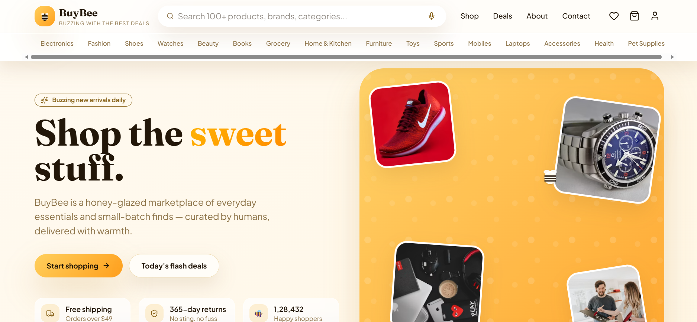

<p align="center">
  
</p>

# BuyBee — Buzzing Deals Marketplace

A modern React + Vite e-commerce storefront built with TanStack Start and Tailwind CSS. BuyBee is designed as a premium product showcase and shopping experience with fast page navigation, responsive UI, and rich client-side interactions.

## ✨ Project Highlights

- **Responsive e-commerce storefront** with category browsing, product pages, cart, wishlist, checkout, and account flows.
- **Modern React ecosystem** using `react`, `tailwindcss`, `vite`, and `@tanstack/react-router`.
- **Optimized UI components** built with Radix UI primitives and reusable design system patterns.
- **Rich UX features** including toast notifications, carousel displays, search, and mobile-friendly navigation.
- **Full dev workflow** with frontend, backend, and combined local development scripts.

## 🚀 What’s Included

- `src/` — React application source code and route definitions
- `public/` — static assets and public files
- `backend/` — backend service and Java source files
- `scripts/` — development helpers for running frontend and backend together
- `vite.config.js` — Vite app configuration
- `package.json` — project dependencies and scripts

## 🧰 Tech Stack

- React 19
- Vite
- Tailwind CSS 4
- TanStack React Router
- TanStack React Query
- Radix UI primitives
- Sonner toast notifications
- Recharts charting
- `react-hook-form` + `zod`

## ⚡ Setup & Run

```bash
# install dependencies
npm install

# run frontend locally
npm run dev

# run backend locally
npm run dev:backend

# run both frontend and backend
npm run dev:all
```

## ✅ Build & Preview

```bash
npm run build
npm run preview
```

## 📁 Project Structure

- `src/` — main React application code
- `src/components/` — reusable UI and layout components
- `src/routes/` — app routes and page definitions
- `src/context/` — global state and store provider
- `src/lib/` — utility modules and error handling
- `src/data/` — product data and sample collections
- `backend/` — backend service and server-side resources

## 💡 Notes

- The app is built for fast, interactive shopping experiences and is ideal for portfolio demos.
- The project is already configured with modern tooling and script workflows for local development.

## 📌 Recommended Improvements

- Add real backend integration for product data, payments, and authentication.
- Add unit and integration tests for route flows and user interactions.
- Add deployment configuration for Vercel, Netlify, or cloud-hosted backend.

---

## Contact

Built with care for an elegant e-commerce portfolio showcase.
